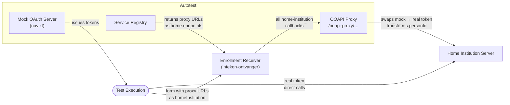
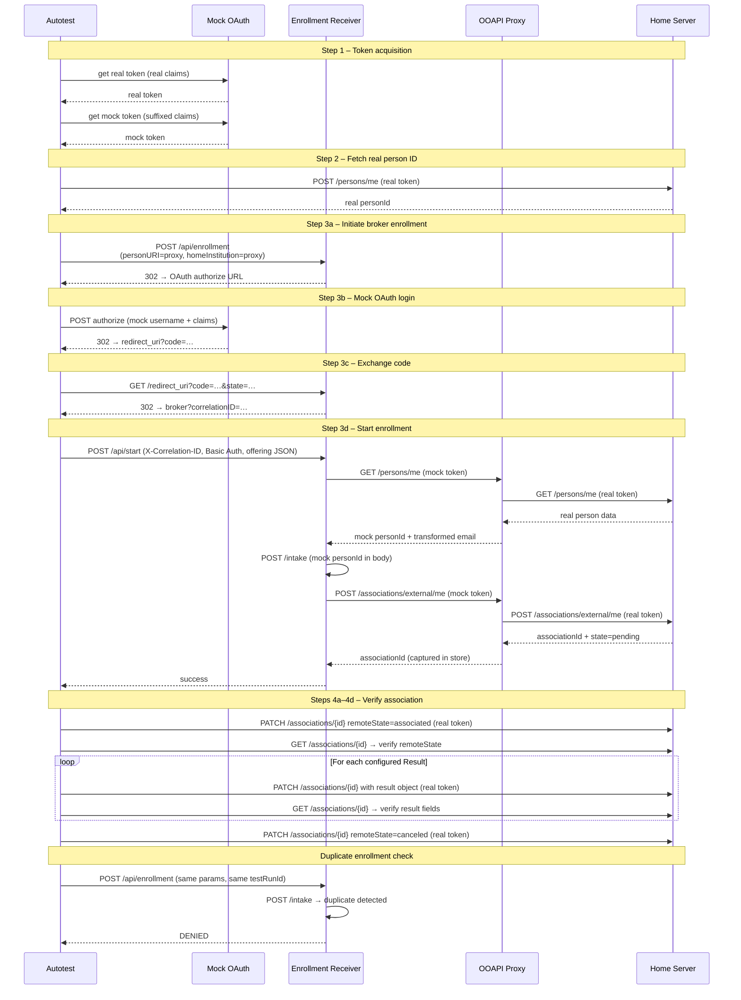

# EuroTeQ AutoTest

A Spring Boot + React application for automated end-to-end testing of EuroTeQ EduXchange enrollment flows between home and host institutions.

---

## Table of Contents

- [Overview](#overview)
- [Architecture](#architecture)
- [Enrollment Flow (BROKER mode)](#enrollment-flow-broker-mode)
- [Mock Identity Mechanism](#mock-identity-mechanism)
- [Configuration](#configuration)
- [Key Classes](#key-classes)
- [Test Outcomes](#test-outcomes)

---

## Overview

The application tests enrollments from every configured home server to every configured host server. For each **TestUser × Offering** combination it runs the full broker enrollment flow and records the outcome.

Results are presented as a matrix — home servers on one axis, host servers on the other. Each cell shows the success/deny/error counts for that pair; clicking it drills down to per-test-case details including the full request/response trace.

---

## Architecture



### What the Application Mocks

#### OAuth / Identity Provider

Real EduXchange deployments require student authentication via an institutional identity provider. This is replaced by **mock-oauth2-server** (navikt), which issues JWTs for any `username` + `claims` pair without a real IdP or interactive login.

When `euroteq.mock-user.suffix` is set, the autotest generates two tokens per test user:

| Token | Claims | Used by |
|---|---|---|
| **Real token** | Unchanged (`sub`, `email`, ESI code, …) | Home institution server |
| **Mock token** | Suffixed username/email | Enrollment receiver |

#### Service Registry

The enrollment receiver uses a service registry to validate requests and discover home institution endpoints. The autotest provides a built-in mock at `/service-registry/api/…`:

| Endpoint | Returns |
|---|---|
| `POST /api/validate-service-registry-endpoints` | `true` if `homeInstitution` matches a configured home server or an autotest proxy URL |
| `POST /api/associations-uri` | `{homeInstitution}/associations` |
| `POST /api/persons-uri` | `{homeInstitution}/persons/me` |

Configure the enrollment receiver with:

```
BROKER_SERVICE_REGISTRY_BASE_URL=http://<autotest-host>:<port>/service-registry
```

#### OOAPI Proxy

`OoapiProxyController` sits between the enrollment receiver and the real home server:

1. **Token swap** — Replaces the mock Bearer token with the real token before forwarding. The home server always sees the real identity.
2. **Person identity transformation** — When person data is fetched, the proxy replaces `personId` with `UUID.nameUUIDFromBytes((realPersonId + testRunId).getBytes())` and plus-addresses the email. This gives each test run a unique mock personId, while keeping it stable within a run (so duplicate detection works correctly).
3. **Association capture** — On a successful `POST /associations/external/me`, the proxy captures the returned `associationId` in `AssociationCaptureStore` for use in the verification steps.

---

## Enrollment Flow (BROKER mode)



### Duplicate Enrollment Test

After a successful enrollment the autotest immediately re-runs Steps 3a–3d with identical parameters. Because the mock personId is derived from `testRunId`, the second attempt reuses the same mock personId, and the business backend detects the duplicate. The autotest expects `DENIED` and logs the outcome as `duplicateEnrollment`.

---

## Mock Identity Mechanism

The core challenge: the enrollment receiver must see a **unique identity on each test run** (to avoid duplicate detection), while the home institution must always see the **real identity**.

### Dual tokens

```
Real token:  { sub: "s149683",          email: "student@example.com" }
Mock token:  { sub: "s149683autotest",  email: "student+autotest@example.com" }
```

### Stable mock personId

```
mockPersonId = UUID.nameUUIDFromBytes( (realPersonId + testRunId).getBytes() )
```

- **Unique across runs** — different `testRunId` → different UUID → no duplicate detection between runs.
- **Stable within a run** — same `testRunId` → same UUID → duplicate detection works for re-enrollment within the same run.

### Token store

`RealTokenStore` maps each proxy session to its real token:

| Method | When called |
|---|---|
| `store(sessionId, realToken)` | During Step 3a setup |
| `lookup(sessionId)` | By the proxy on every forwarded request |
| `remove(sessionId)` | After test completion |

---

## Configuration

### Home Servers

| Field | Description |
|---|---|
| Name, URL | Identifies the home institution's OOAPI server |
| Basic Auth | Optional; used in addition to Bearer token |
| **Test Users** | `username`, `claims` JSON, optional `academicLevel`, optional `alwaysDenied` flag |

### Host Servers

| Field | Description |
|---|---|
| Name, URL | The enrollment receiver endpoint |
| Enrollment Mode | `BROKER` |
| Broker Scope | OAuth scope, e.g. `offline_access email dtu.dk/persons` — do **not** include `openid` |
| Basic Auth | Credentials for `/api/start` |
| **Offerings** | `offeringId`, optional `offeringData` (JSON) |
| **Results** | Named result objects with fields matching the home server's `Result` model (`state`, `pass`, `comment`, `score`, `resultDate`, `ext`, `studyLoad`). All results are verified for every successful enrollment — they are not tied to individual offerings. |

### Mock User Suffix

```yaml
# application.yml
euroteq:
  mock-user:
    suffix: autotest
```

### Service Registry URL (on the enrollment receiver)

```
BROKER_SERVICE_REGISTRY_BASE_URL=http://<autotest-host>:<port>/service-registry
```

---

## Key Classes

| File | Purpose |
|---|---|
| `service/TestExecutionService.java` | Orchestrates the full test flow for each TestUser × Offering |
| `controller/OoapiProxyController.java` | Token swap, personId transformation, associationId capture |
| `controller/ServiceRegistryController.java` | Mock service registry; returns proxy URLs as home endpoints |
| `service/RealTokenStore.java` | In-memory session → real token map |
| `service/AssociationCaptureStore.java` | In-memory session → associationId map |
| `service/TokenService.java` | Generates real and mock OAuth tokens with claims transformation |

---

## Test Outcomes

| Outcome | Meaning |
|---|---|
| `SUCCESS` | Enrollment succeeded and all verification steps passed |
| `DENIED` | Enrollment was explicitly rejected (HTTP 401, 403, or 412) |
| `ERROR` | Technical failure (network error, exception, or unexpected response) |
| `SKIPPED` | Not currently assigned |

The `stepDetails` field on each result is a JSON array of step objects containing URLs, HTTP status codes, request/response bodies, and any verification mismatches.
